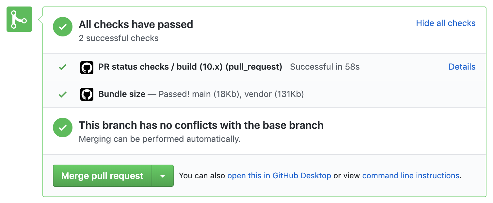
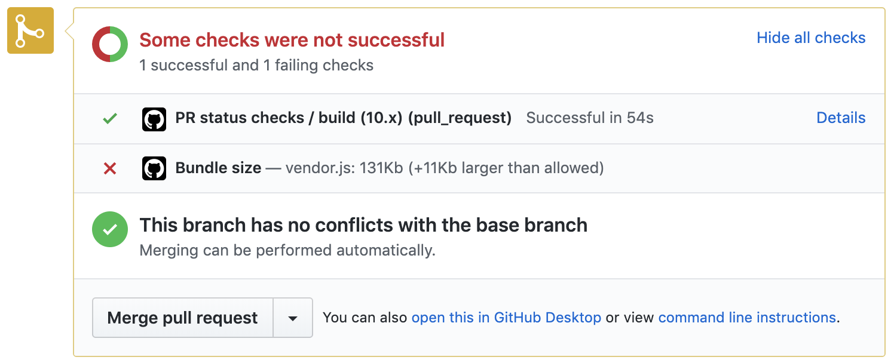

# Github Action Status Check

Use Github Actions to run your own PR status checks.

See the `src/status.yml` for an example action config.

The script will run all checks exported from `src/checks.js`.

## How to use

- Copy the `status.yml` into your `.github/workflows`
- Copy `status-checks` into your project somewhere
- Update the `path/to/status-checks` in `status.yml` with the correct path

You can test the status check by making a PR in Github and runnning the script while on the branch.

```bash
GITHUB_REPOSITORY=owner/repo GITHUB_TOKEN=YOUR_TOKEN node path/to/status-checks
```

## Creating a check

A checks should export an Object with a name and callback.

```js
module.exports = {
  name: 'My Check';
  callback: async () => 'Check passed!';
}
```

Add the check to the action by adding it to the `check` list in `src/checks`.

#### Passing

A check is considered successful if the callback resolves. The callback should resolve (return) a string, which will be used as the success status check description.

#### Failing

To fail a check, the callback can throw an Error. The error message will be used as the status description.

**Example:**
```js
module.exports = {
  name: 'My Check';
  callback: async () => {
    throw new Error('Check failed!');
  };
}
```

## Bundle Size Example

This package includes a simple bundle size status check that can measure the gzip size of files for given patterrns.

It lets you set limits on bundles and pass/fail PRs based on their size.

Inspired by [siddharthkp/bundlesize](https://github.com/siddharthkp/bundlesize/).




